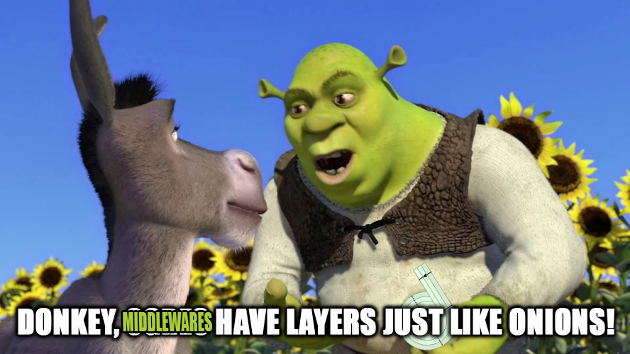

# Shrext - middleware for Next.js Data Fetching Functions
<!-- badges -->
[](https://badge.fury.io/js/shrext)


<p align="center">
  
</p>

Simple tool to make composable middleware for Next.js data fetching functions. Inspired by [Middy](https://github.com/middyjs/middy), but like, you know, for Next.js.

> Dreamworks, please don't sue me.

## Installation

```bash
npm install shrext
```

## Usage

Define a middleware:
```typescript
import type { MiddlewareObject } from 'shrext'

// This is a middleware that adds a database to the context
// and disconnects it after the handler has run
const withDatabase: MiddlewareObject = {
  before: async (context, shrextContext) => {
    // add the database to the context, so it can be used in the handler and other middleware
    Object.assign(shrextContext, {
      database: new Database(),
    })
  },
  after: async (result, shrextContext, nextContext) => {
    // other middleware can modify the context, so we need to check if the database is still there
    if ('database' in shrextContext && shrextContext.database instanceof Database) {
      await shrextContext.database.disconnect()
    }
  },
}
```

Then, in the page file:
```typescript
import { shrext } from 'shrext'

export const getServerSideProps = shrext<GetServerSideProps, { database: Database }>(
  async (context, shrextContext) => {
    const { params } = context
    const { database } = shrextContext

    const data = await database.getSomething(params?.id)

    return { props: { data } }
  },
).use(withDatabase)
```

Can be used the same way with `getStaticProps` and `getStaticPaths`.

### Another example

Here, a simple middleware that adds a prop `withBackground` to the result of `getStaticProps`:
```typescript
export const getStaticProps = shrext<GetStaticProps>(
  async (context, shrextContext) => {
    // ... something here
    return { props: { data } }
  },
).after((result) => {
  if ('props' in result) {
    Object.assign(result.props, { withBackground: true })
  }
  return result
})
```

Or here's a handy one, that removes undefined values, so Next.js doesn't complain about serialization:
```typescript
export function deepOmitUndefinedEntries<T extends object>(object: T): T {
  return mapValues(omitBy(object, isUndefined), (value) => {
    if (isObject(value)) {
      return deepOmitUndefinedEntries(value)
    }
    return value
  }) as T
}
export const omitUndefined: MiddyAfterMiddleware = (result) => {
  if ('props' in result) {
    result.props = deepOmitUndefinedEntries(result.props)
  }
  return result
}
```

Usage:
```typescript
export const getStaticProps = shrext<GetStaticProps>(
  async (context, shrextContext) => {
    // ... something here
    return { props: { data: {
      a: 1,
      b: undefined,
      c: {
        d: 2,
        e: undefined,
      },
    } } }
  },
).after(omitUndefined)
```

Page props will be:
```typescript
{
  data: {
    a: 1,
    c: {
      d: 2,
    },
  },
}
```

## License

Licensed under [MIT License](LICENSE). Copyright (c) 2023 [Nazar Vovk](https://github.com/nazarvovk).